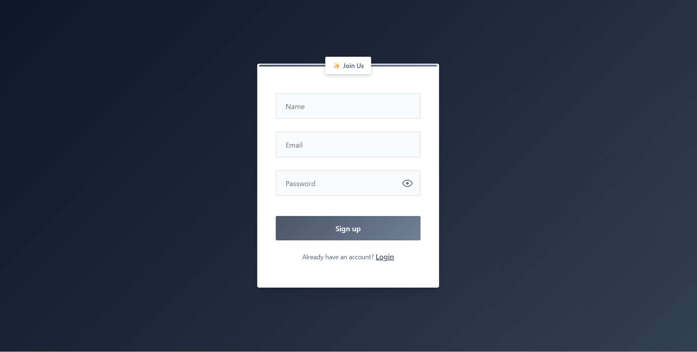
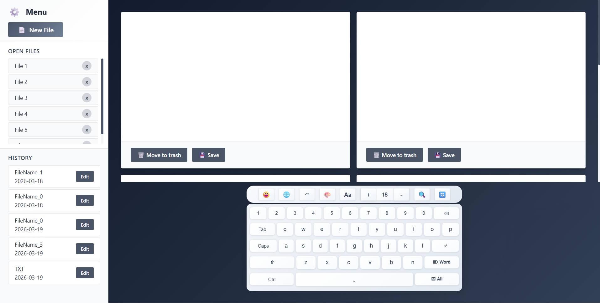
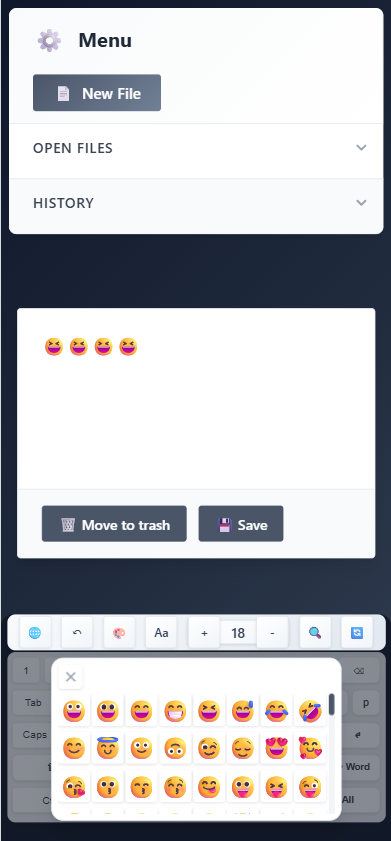

#  React Keyboard Editor

### Interactive Text Editor with Real-Time Styling & Keyboard Visualization

A modern, responsive **text editing application** built with React, featuring real-time styling controls, a virtual keyboard visualization system, and client-side authentication.

---

 **Live Demo:**  
👉 https://AvitalLugassi.github.io/react-keyboard-editor

---

##  Project Overview

This project demonstrates the development of an interactive client-side editor that combines:

* Real-time text rendering
* Dynamic styling controls
* Keyboard event visualization
* Undo/Redo state management
* Modular component architecture

The focus is on **user interaction, responsiveness, and clean architecture design**.

---
##  Screenshots

| Login | Editor |
|------|--------|
|  |  |

### 📱 Mobile View

<p align="center">
  
</p>

---

##  Features

###  Text Editor

* Live typing experience
* Font selection
* Text color & background styling
* Emoji support
* Undo / Redo functionality

---

###  Virtual Keyboard Manager

* Visual representation of keyboard input
* Real-time key highlighting
* Interactive feedback system
* Customizable keyboard UI

---

###  Authentication

* Login / Signup interface
* Persistent user storage using `localStorage`
* Password visibility toggle

---

##  Technical Challenges

* Implementing **Undo/Redo state history management**
* Synchronizing **keyboard events with UI updates**
* Preventing unnecessary **React re-renders**
* Managing dynamic styling efficiently
* Structuring reusable and scalable components

---

##  Architecture

The project is built using a modular structure:

```
src/
 ├── components/
 │     ├── Login/
 │     ├── Menu/
 │     │     └── DisplayArea/
 │     └── KeyboardManager/
 │           ├── keyboard/
 │           └── controls/
 │                 ├── FontControl
 │                 ├── ColorControl
 │                 ├── EmojiControl
 │                 ├── UndoControl
 │                 └── SearchReplaceControl
 │
 ├── App.jsx
 └── main.jsx
```

This structure ensures:

* Separation of concerns
* Reusability
* Maintainability


---

##  Tech Stack

* React
* Vite
* JavaScript (ES6+)
* CSS
* GitHub Pages (Deployment)

---

##  Getting Started

### Install dependencies

```bash
npm install
```

### Run development server

```bash
npm run dev
```

Open:
[http://localhost:5173](http://localhost:5173)

---

### Build for production

```bash
npm run build
```

---

### Preview production

```bash
npm run preview
```

---

##  Deployment

```bash
npm run deploy
```

---

##  What I Learned

* Building complex interactive UI systems
* Managing state and user interactions in React
* Handling real-time updates efficiently
* Designing scalable component structures
* Improving responsive design

---

##  Future Improvements

* Server-side authentication
* Rich text formatting (bold, italic, lists)
* Keyboard shortcuts system
* File export/import support

---

##  License

MIT License
